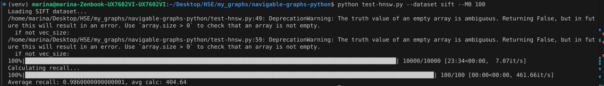
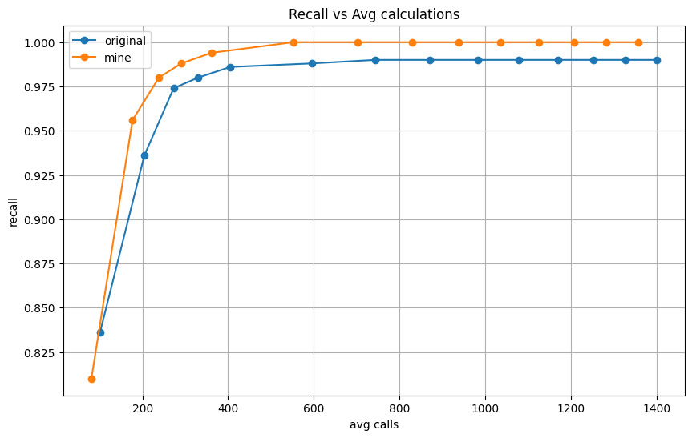

# Navigable Graphs Python
Python based research tool for studying navigable graphs for nearest neighbour search

Using the SIFT dataset:
```
python navigable-graphs.py --dataset sift
```

Using synthetic data with 3D vectors:
```
python navigable-graphs.py --dataset synthetic --K 20 --k 5 --dim 3 --n 500 --nq 100 --ef 20 --M 2
```

# Results 

As shown in the pictures below, updated implementation optimizes graph creation for faster and more precise search.

Original work reached Recall of 0.986 in 404.64 calls on average with default `ef` parameter.



Updated graph construction allows for higher Recall of 0.994 in just 361.27 calls on average with the same set of parameters.


The ratio persist over different `ef` values:

